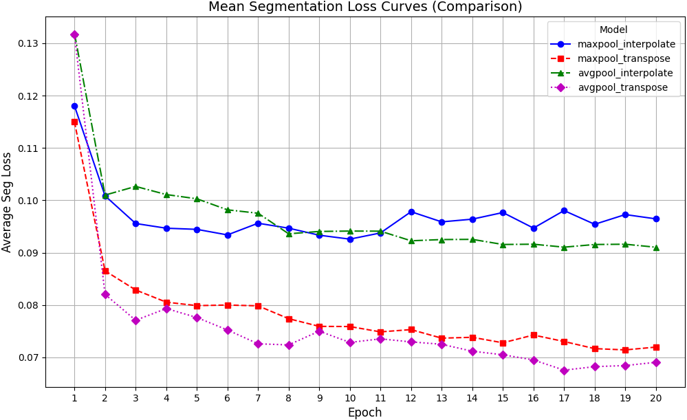
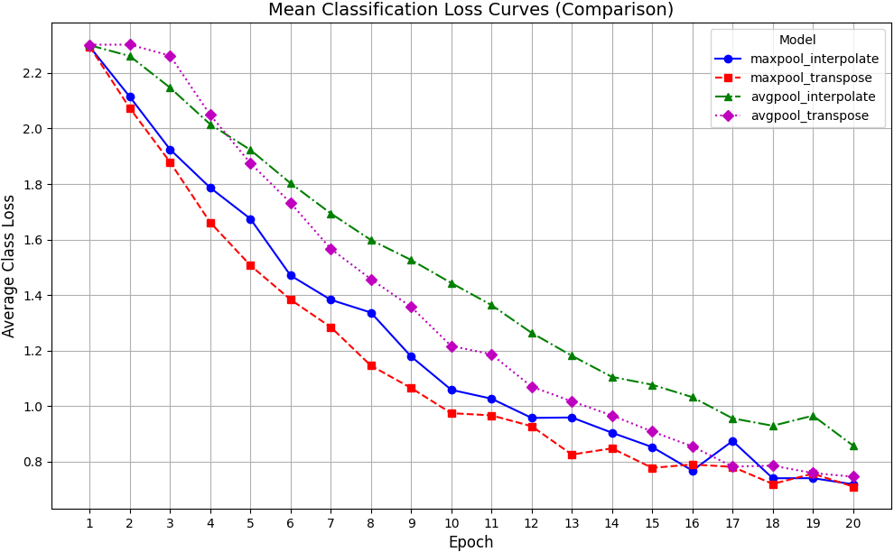

# 手写数字分割

## 1 Directory Structure
- **`./data/`**: 存放 MNIST 数据集、网络搜集的纹理背景图片、图片预处理脚本和手写数字分割数据集构建脚本
- **`./weights/`**: 存放模型的权重。train.py 自动保存训练好的权重文件
- **`./train/`**: 存放 train.py 的中间输出结果和日志
- **`./test/`**: 存放 test.py 的中间输出结果和日志
- **models.py**: 定义 MultiTaskLeNet5 模型结构和其他自定义类
- **train.py**: 总训练代码
- **eval.py**: 总测试代码
- **requirements.txt**: 库及版本

## 2 Installation
配置虚拟环境
```shell script
git clone https://github.com/Xincheng-Tan/Digit_Recognition.git
conda create -n digit python=3.10
conda activate digit
cd Digit_Segmentation & pip install -r requirements.txt
```

## 3 Results
**MultiTaskLeNet5 不同模型版本在测试集上的整体指标**
|Versions|Mean IoU|Foreground IoU|Mean Dice|Foreground Dice|Classification Accuracy|
|---|---|---|---|---|---|
|maxpool_interpolate|0.8211|0.6583|0.8929|0.7938|83.08%|
|maxpool_transpose|0.8612|0.7343|0.9204|0.8467|**83.36%**|
|avgpool_interpolate|0.8299|0.6750|0.8991|0.8058|78.13%|
|avgpool_transpose|**0.8664**|**0.7438**|**0.9237**|**0.8530**|81.17%|

训练过程中，MultiTaskLeNet5 不同版本在**在训练过程中分割损失变化情况**
<p align="center">
  
</p>

训练过程中，MultiTaskLeNet5 不同版本在**在训练过程中分类损失变化情况**
<p align="center">
  
</p>
